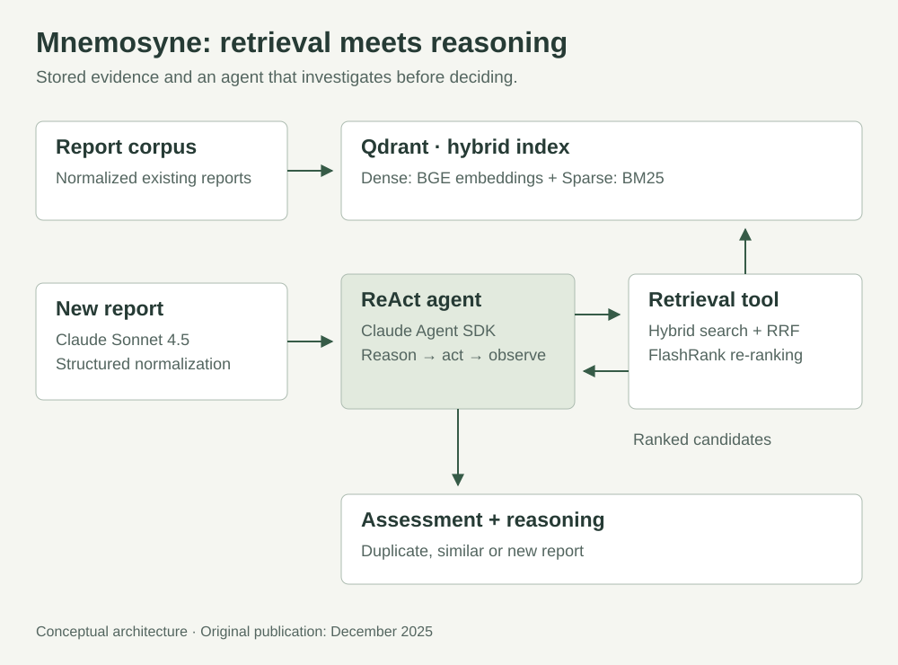
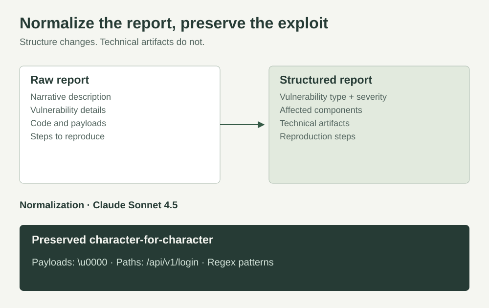
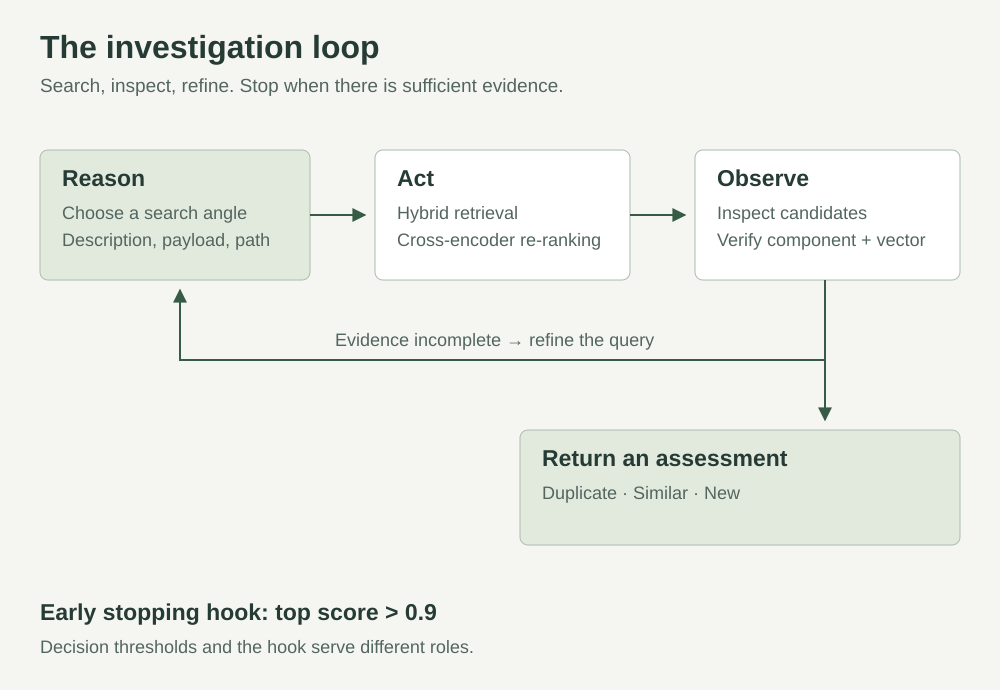

# Building An Agentic System for Bug Bounty Duplicate Detection

## The Problem: Drowning in Duplicate Reports

If you’ve ever participated in a bug bounty program — or managed one — you know the pain of duplicate reports. It happens constantly: security researchers independently discover the same vulnerability and submit nearly identical findings.

For platforms like HackerOne, this creates a massive operational burden. Triagers spend countless hours manually comparing new submissions against thousands of existing reports, while researchers waste valuable time documenting bugs that have already been found. Ultimately, programs struggle to scale effectively because the administrative load grows exponentially with the report volume.

The question that sparked this project was simple: Can we automate duplicate detection for security reports?

This isn’t just a standard semantic similarity problem. Security reports contain a unique, messy mix of natural language descriptions (“SQL Injection in login endpoint”), technical artifacts (payloads like `' OR '1'='1`), and structured data.

Traditional approaches often fall short here. Pure semantic search tends to miss exact payload matches, while simple keyword search lacks the nuance to understand that “SQLi” and “SQL Injection” are the same thing. Even static rules break easily when reports use slightly different terminology. We needed something smarter.

## The Solution: Hybrid Search + Agentic Reasoning

To solve this, I built an intelligent duplicate detection system. Rather than relying on a single algorithm, it combines three key technologies: Hybrid Vector Search (Semantic + Keyword), Cross-Encoder Re-ranking, and a ReAct Agent powered by Claude Sonnet 4.5.

Let me break down how these components work together to solve the deduplication puzzle.

## Architecture Overview



## 1. Report Normalization: Structure from Chaos



Security reports come in wildly different formats — from polished Markdown documents to raw text dumps with embedded code. Before we can compare them, we need to standardize them.

The first step is normalization using Claude Sonnet 4.5. We feed the raw report into the model and enforce a structured JSON output. This extracts critical fields like the vulnerability type, severity, affected components, and reproduction steps.

Critically, we enforce a strict rule: Technical artifacts are never modified. Payloads like `\u0000` or specific regex patterns must be preserved character-for-character, as a single modification could break the detection logic or render the exploit invalid.

## 2. Hybrid Vector Search: Best of Both Worlds

We use Qdrant as our vector database with a dual-vector approach to capture both meaning and specific details:

- **Dense Vectors (Semantic Understanding):** Using the `BAAI/bge-large-en-v1.5` model, we capture the semantic meaning of the report. This allows the system to understand that "SQL Injection", "SQLi", and "database injection vulnerability" are conceptually identical.
- **Sparse Vectors (Exact Matching):** Using the `Qdrant/bm25` algorithm, we index exact keywords, payloads, and paths. This ensures that if a report contains a specific string like `'/api/v1/login'` or a unique XSS payload, we find it.

We combine these results using Reciprocal Rank Fusion (RRF). This strategy balances semantic and keyword relevance, preventing one search type from dominating the other and ensuring robust results even when queries are phrased differently.

## 3. Re-ranking: Precision Refinement

Hybrid search typically returns about 20 potential candidates. To find the true needle in the haystack, we re-rank these results using FlashRank with a cross-encoder model (`ms-marco-TinyBERT-L-2-v2`).

While the bi-encoders used in the initial search are fast, they process the query and document separately. Cross-encoders, on the other hand, examine the query and document together. This is computationally more expensive but significantly more accurate, giving us the best of both worlds: high-speed retrieval followed by high-precision ranking.

## 4. The ReAct Agent: The Brain

Here’s where it gets interesting. Instead of firing off a single search query and hoping for the best, we use a ReAct agent (Reasoning + Acting) powered by Claude Sonnet 4.5 via the Claude Agent SDK.

The agent doesn’t just search; it investigates.



*Agent workflow*

For example, when analyzing a new SQL Injection report, the agent might start with a broad semantic search. If the confidence scores are low (e.g., below 0.65), it reasons that it needs to be more specific. It might then execute a targeted search for the specific payload (`admin' OR '1'='1`). If it finds a match with a high score (0.89), it verifies the affected component to confirm the duplicate.

This approach offers several benefits:

- **Iterative refinement:** The agent learns from the initial results and adjusts its strategy.
- **Multi-angle validation:** It can triangulate a match using descriptions, payloads, and component paths.
- **Explainability:** Every decision comes with a reasoning trace, so we know why a report was flagged.

## Implementation: The Power of Claude Agent SDK

Initially, I built the ReAct loop manually using the standard Anthropic Python SDK. It required about 400 lines of code to manage the message history, tool execution, and loop logic. Recently, I migrated to the Claude Agent SDK, and it was a game changer.

The migration reduced the codebase by nearly 50%. Instead of manually managing the loop, the SDK allows for a declarative approach.

**Before (Manual Implementation):** You had to manually loop through messages, check for `tool_use` blocks, execute the functions, append the results, and manage your own early stopping logic.

**After (Claude Agent SDK):** The code becomes much cleaner. We define tools and hooks declaratively:

```python
# Declarative SDK approach
@tool("hybrid_search", "Search for similar reports", {"query": str, "limit": int})
async def hybrid_search_tool(args):
    results = searcher.hybrid_search(args["query"], args["limit"])
    return {"content": [{"type": "text", "text": format(results)}]}

# Hook for early stopping
async def early_stopping_hook(input_data, tool_use_id, context):
    if input_data["tool_response"]["_metadata"]["top_score"] > 0.9:
        return {
            "continue_": False,
            "stopReason": "early_stopping_high_confidence_match"
        }
    return {"continue_": True}

# Running the agent
options = ClaudeAgentOptions(
    mcp_servers={"dedup": create_sdk_mcp_server(tools=[hybrid_search_tool])},
    hooks={"PostToolUse": [HookMatcher("hybrid_search", [early_stopping_hook])]}
)
async with ClaudeSDKClient(options=options) as client:
    await client.query(format_report(new_report))
```

This shift provided better observability, built-in cost tracking, and allowed me to focus on the detection logic rather than the plumbing of the agent loop.

## Performance & Real-World Usage

In a typical scan, the agent runs for about 30–40 seconds across 5 iterations. However, thanks to the early stopping hook, clear duplicates (score > 0.9) are detected in just 10–15 seconds, significantly reducing API costs.

The system uses three thresholds for decision making:

- **> 0.85 (Duplicate):** Same vulnerability, component, and attack vector.
- **0.65–0.85 (Similar):** Related vulnerability but potentially different context.
- **< 0.65 (New):** No relevant matches found.

## Conclusions

Working with this type of problem taught me that Hybrid Search is non-negotiable. Pure keyword search (BM25) frequently failed when reports used different terminology to describe the same bug (e.g., “SQLi” vs. “Database Injection”). Adding semantic vectors to capture the meaning behind the text improved our recall by approximately 55%.

This led to a crucial insight regarding the workflow. Working with real duplicates showed us an interesting pattern: for exact matches, the system invokes early stopping almost immediately, performing effectively like a fast single-shot query with high accuracy. The ReAct agent reveals its true potential not on these obvious duplicates, but on similar or ambiguous reports.

In those edge cases where a simple search fails (hovering around 0.67 accuracy), the agent’s ability to “think,” refine its query, and pivot strategies boosted our overall detection accuracy to 0.89.

The project is open available on GitHub. It features a fully functional CLI built with Typer, allowing you to ingest and scan reports directly from your terminal.

GitHub: [Mnemosyne](https://github.com/Adrihp06/Mnemosyne)

The repository includes detailed setup instructions and a Docker configuration to get the full stack (Python 3.12, Qdrant, and FastEmbed) running in under 10 minutes.

If you’re working on document deduplication, semantic search, or agentic workflows, I hope this architecture provides some useful patterns. Feel free to drop a comment if you have questions about the implementation!
